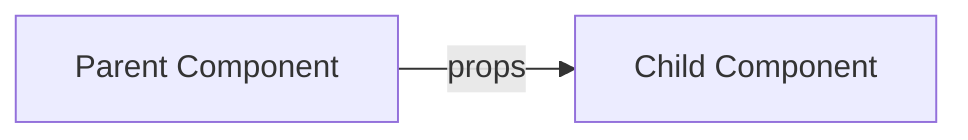

# ⚛️ React Props and Hooks Guide

This guide provides an overview of key **React concepts**:
➡️ **Props**
➡️ **PropTypes**
➡️ **defaultProps**
➡️ **Conditional Rendering**
➡️ **Click Events**
➡️ **React Hooks** (with examples of `useState`)

---

## 📑 Table of Contents

* [Props](#props)
* [PropTypes](#proptypes)
* [defaultProps](#defaultprops)
* [Conditional Rendering](#conditional-rendering)
* [Click Events](#click-events)
* [React Hooks](#react-hooks)

  * [useState Hook](#usestate-hook)
* [onChange Event Handler](#onchange-event-handler)
* [Updater Function](#updater-function)

---

## 🧩 Props

Props (short for **properties**) are **read-only attributes** used to pass data from a parent component to a child component in React.
They make components **dynamic and reusable**.

* **Purpose:** Share data between components
* **Usage:** Passed as attributes in JSX

<details>
<summary>Example</summary>  

```jsx
<Component key="value" />
```

</details>  

📌 **Flow of Props:**



---

## ✅ PropTypes

`PropTypes` helps with **type-checking** props to avoid runtime errors.

* **Purpose:** Validate prop data types

<details>
<summary>Example</summary>  

```jsx
import PropTypes from "prop-types";

MyComponent.propTypes = {
  age: PropTypes.number,
};
```

</details>  

---

## 🛠 defaultProps

`defaultProps` provide **default values** when props are not passed.

<details>
<summary>Example</summary>  

```jsx
MyComponent.defaultProps = {
  name: "Guest",
};
```

</details>  

---

## 🔄 Conditional Rendering

Conditionally show or hide components.

<details>
<summary>Example</summary>  

```jsx
{isLoggedIn ? <UserDashboard /> : <LoginScreen />}
```

</details>  

---

## 🖱 Click Events

Handle user interactions like button clicks.

<details>
<summary>Example</summary>  

```jsx
<button onClick={() => alert("Clicked!")}>Click Me</button>
```

</details>  

---

## ⚡ React Hooks

Hooks let functional components use **state and lifecycle features** without classes.

* **Common Hooks:**

  * `useState`
  * `useEffect`
  * `useContext`
  * `useReducer`
  * `useCallback`

📌 **React Lifecycle with Hooks:**

```mermaid
graph TD
A[Component Mounts] --> B[useEffect (runs once if deps=[])]
B --> C[Re-render on state/prop change]
C --> D[useEffect (runs on deps change)]
D --> E[Cleanup Function before unmount]
```

---

### 📝 useState Hook

Manages **state variables** in functional components.

<details>
<summary>Example</summary>  

```jsx
import { useState } from "react";

function MyComponent() {
  const [name, setName] = useState("Guest");

  return (
    <button onClick={() => setName("User")}>
      {name}
    </button>
  );
}
```

</details>  

---

## ✍️ onChange Event Handler

Used with form elements (`<input>`, `<textarea>`, `<select>`, `<radio>`).
It triggers whenever the input value changes.

<details>
<summary>Example</summary>  

```jsx
<input type="text" onChange={(e) => setValue(e.target.value)} />
```

</details>  

---

## 🔁 Updater Function

Safely update state based on the **previous value**.

<details>
<summary>Example</summary>  

```jsx
setYear((y) => y + 1);
```

</details>  

---

# 🔄 React `useEffect()` Hook

The **`useEffect`** hook lets you perform **side effects** in function components.  
It tells React to run some code when:

- The component **mounts** (first render)
- The component **re-renders**
- Specific **state/props values change**
- The component **unmounts** (cleanup)

---

## 📝 Syntax

```jsx
useEffect(function, [dependencies]);


1. useEffect(() => {})  // Runs after every re-render
  useEffect(() => {
  console.log("Runs after every render");
});

2. useEffect(() => {}, [])  // Runs only on mount
  useEffect(() => {
  console.log("Runs only on mount (first render)");
}, []);

3. useEffect(() => {}, [value]) // Runs on mount + when value changes
  useEffect(() => {
  console.log("Runs on mount and whenever 'value' changes");
}, [value]);


### USES:
  1. Event Listeners
  2. DOM manipulation
  3. Subscriptions (real-time updates)
  4. Fetching Data from an API
  5. Clean up when a component unmounts

 
  